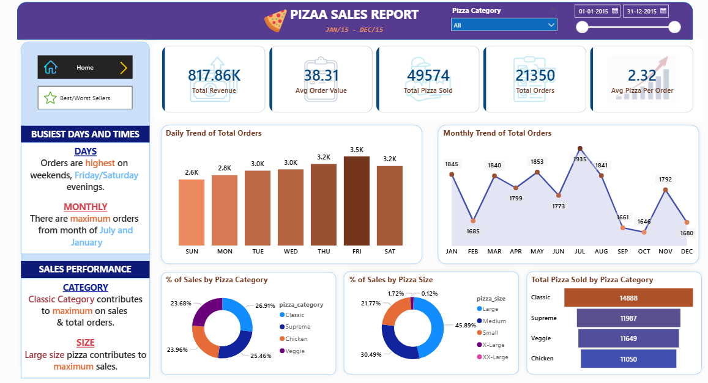
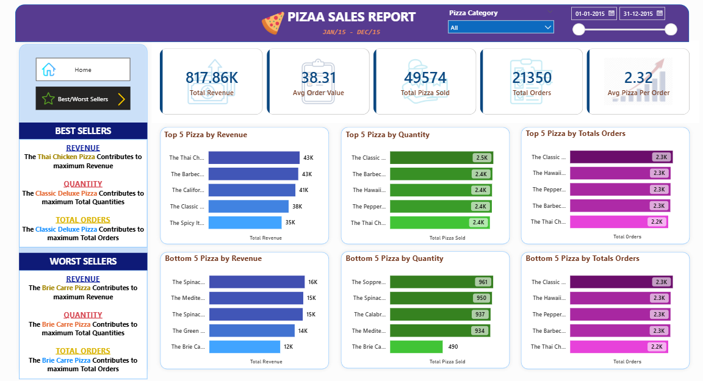

# 🍕 Pizza Sales Dashboard (SQL + Power BI)

## 📌 Overview
This project analyzes pizza sales data to extract business insights and visualize key performance metrics using SQL and Power BI.  
The goal is to understand sales trends, customer behavior, and product performance to support data-driven decision-making.

---

## 🎯 Problem Statement
We need to analyze pizza sales data to identify:
- Overall business performance (Revenue, Orders, Quantity)
- Sales trends over time (Daily & Monthly)
- Category and size-wise contribution
- Top and bottom performing products

---

## ⚙️ Tech Stack
- **SQL** – Data analysis & KPI calculations  
- **Power BI** – Data visualization & dashboard  
- **Excel** – Dataset  

---

## 📊 Key KPIs
- **Total Revenue**
- **Average Order Value**
- **Total Pizzas Sold**
- **Total Orders**
- **Average Pizzas per Order**

---

## 📈 Analysis Performed

### 1. Sales Trends
- Daily trend of total orders
- Monthly trend of order volume

### 2. Category Insights
- % of sales by pizza category
- % of sales by pizza size

### 3. Performance Analysis
- Top 5 pizzas by revenue, quantity, and orders
- Bottom 5 pizzas by revenue, quantity, and orders

---

## 🧠 SQL Analysis
Performed advanced SQL queries including:
- Aggregations (`SUM`, `COUNT`, `AVG`)
- Grouping and filtering
- Window-based analysis
- Business KPI calculations

👉 Full SQL queries available here:  
`/sql/PIZZA SALES SQL QUERIES.docx`

---

## 📊 Dashboard Preview

### 🔹 Main Dashboard

### 🔹 Best & Worst Sellers Analysis

---

## 🔍 Key Insights
- 📅 Orders are highest on **weekends (Friday & Saturday evenings)**
- 📆 Maximum orders occur in **July and January**
- 🍕 **Classic category** contributes the highest revenue and orders
- 📏 **Large size pizzas** dominate total sales
- 🥇 Top products significantly outperform bottom performers, indicating demand concentration

---

## 🚀 Outcome
This project demonstrates:
- End-to-end data analysis workflow  
- SQL-based data extraction and transformation  
- Interactive dashboard design in Power BI  
- Business insight generation from raw data

---

## 📂 Project Structure
pizza-sales-dashboard/
│
├── dataset/ # Raw dataset
├── sql/ # SQL queries
├── dashboard/ # Power BI file (.pbix)
├── screenshots/ # Dashboard images
└── README.md

---

## 👨‍💻 Author
**Sahil Tawari**  
- GitHub: https://github.com/sahiltawari  
- LinkedIn: https://linkedin.com/in/sahil-tawari  

---

## ⭐ If you found this useful
Give this repo a star ⭐ and feel free to connect!

---

## 📂 Project Structure
